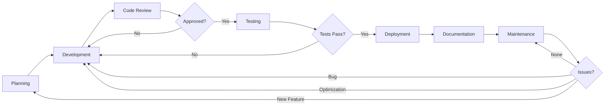

# Workflow Visualization

> Visual representations of the workflow automation system

## Overall Workflow Architecture

```
┌─────────────────────────────────────────────────────────────────────────┐
│                         CONSTITUTION.MD                                  │
│                    (Company Rules & Principles)                          │
│                                                                          │
│  • Core Values          • Security Policies    • Workflow Stages        │
│  • Dev Standards        • Quality Standards    • Decision Framework     │
└────────────────────┬────────────────────────────────────────────────────┘
                     │
                     │ Governs All Stages
                     │
    ┌────────────────┴────────────────────────────────────────────┐
    │                                                              │
    │              GITHUB COPILOT INSTRUCTIONS                     │
    │         (.github/copilot-instructions.md)                    │
    │                                                              │
    │  • Read constitution before any task                         │
    │  • Follow stage-specific chatmode files                      │
    │  • Maintain consistency across workflow                      │
    └────────────────┬────────────────────────────────────────────┘
                     │
                     │ Guides AI Assistant
                     │
    ┌────────────────┴────────────────────────────────────────────┐
    │                                                              │
    │                   WORKFLOW STAGES                            │
    │                  (prompts/*.chatmode.md)                     │
    │                                                              │
    └──────────────────────────────────────────────────────────────┘
         │       │       │       │       │       │       │
         ▼       ▼       ▼       ▼       ▼       ▼       ▼
    Planning  Dev   Review  Test  Deploy  Docs  Maintain
```

## Detailed Workflow Stages



## Stage Interactions

```
┌──────────────────────────────────────────────────────────────────────┐
│                                                                      │
│  PLANNING STAGE                                                      │
│  ┌────────────────────────────────────────────────────┐            │
│  │ • Gather requirements                               │            │
│  │ • Create user stories                               │            │
│  │ • Technical feasibility                             │            │
│  │ • Risk assessment                                   │            │
│  └───────────────┬────────────────────────────────────┘            │
│                  │                                                   │
└──────────────────┼───────────────────────────────────────────────────┘
                   │
                   ▼
┌──────────────────────────────────────────────────────────────────────┐
│                                                                      │
│  DEVELOPMENT STAGE                                                   │
│  ┌────────────────────────────────────────────────────┐            │
│  │ • Write code                                        │◄──┐        │
│  │ • Write tests (TDD)                                 │   │        │
│  │ • Follow standards                                  │   │        │
│  │ • Security practices                                │   │        │
│  └───────────────┬────────────────────────────────────┘   │        │
│                  │                                          │        │
└──────────────────┼──────────────────────────────────────────┼────────┘
                   │                                          │
                   ▼                                          │
┌──────────────────────────────────────────────────────────────────────┐
│                                                              │        │
│  CODE REVIEW STAGE                                           │        │
│  ┌────────────────────────────────────────────────────┐    │        │
│  │ • Review code quality                               │    │        │
│  │ • Check tests                                       │    │        │
│  │ • Verify security                                   │    │        │
│  │ • Provide feedback                                  │    │        │
│  └───────────────┬────────────────────────────────────┘    │        │
│                  │                                          │        │
└──────────────────┼──────────────────────────────────────────┼────────┘
                   │                              Changes     │
                   │                              Required    │
                   ▼                                          │
┌──────────────────────────────────────────────────────────────────────┐
│                                                              │        │
│  TESTING STAGE                                               │        │
│  ┌────────────────────────────────────────────────────┐    │        │
│  │ • Run unit tests                                    │    │        │
│  │ • Run integration tests                             │    │        │
│  │ • Run E2E tests                                     │    │        │
│  │ • Verify coverage                                   │    │        │
│  └───────────────┬────────────────────────────────────┘    │        │
│                  │                                          │        │
└──────────────────┼──────────────────────────────────────────┼────────┘
                   │                              Tests       │
                   │                              Fail        │
                   ▼                                          │
┌──────────────────────────────────────────────────────────────────────┐
│                                                                      │
│  DEPLOYMENT STAGE                                                    │
│  ┌────────────────────────────────────────────────────┐            │
│  │ • Deploy to staging                                 │            │
│  │ • Smoke tests                                       │            │
│  │ • Deploy to production (gradual)                    │            │
│  │ • Monitor metrics                                   │            │
│  └───────────────┬────────────────────────────────────┘            │
│                  │                                                   │
└──────────────────┼───────────────────────────────────────────────────┘
                   │
                   ▼
┌──────────────────────────────────────────────────────────────────────┐
│                                                                      │
│  DOCUMENTATION STAGE (Concurrent with all stages)                   │
│  ┌────────────────────────────────────────────────────┐            │
│  │ • Update README                                     │            │
│  │ • Document API                                      │            │
│  │ • Create guides                                     │            │
│  │ • Update architecture docs                          │            │
│  └───────────────┬────────────────────────────────────┘            │
│                  │                                                   │
└──────────────────┼───────────────────────────────────────────────────┘
                   │
                   ▼
┌──────────────────────────────────────────────────────────────────────┐
│                                                                      │
│  MAINTENANCE STAGE (Ongoing)                                        │
│  ┌────────────────────────────────────────────────────┐            │
│  │ • Monitor system                                    │            │
│  │ • Respond to incidents                              │            │
│  │ • Fix bugs                                          │────────────┤
│  │ • Performance optimization                          │            │
│  │ • Technical debt management                         │            │
│  └─────────────────────────────────────────────────────┘            │
│                                                                      │
└──────────────────────────────────────────────────────────────────────┘
                   │                                          
                   │  New Feature/Bug/Optimization
                   │                                          
                   └──────────────────┐
                                      │
                                      ▼
                          Back to Planning or Development
```

## AI Assistant Integration

```
┌─────────────────────────────────────────────────────────────────┐
│                                                                 │
│                       DEVELOPER                                 │
│                          │                                      │
│                          │ Asks Question / Writes Code          │
│                          ▼                                      │
│                  ┌───────────────┐                             │
│                  │               │                             │
│                  │  GitHub       │                             │
│                  │  Copilot      │                             │
│                  │               │                             │
│                  └───────┬───────┘                             │
│                          │                                      │
│           ┌──────────────┼──────────────┐                      │
│           │              │              │                      │
│           ▼              ▼              ▼                      │
│   ┌──────────────┐ ┌──────────┐ ┌─────────────┐              │
│   │ Constitution │ │ Copilot  │ │  Chatmode   │              │
│   │    Rules     │ │ Instructions │ │   Files   │              │
│   └──────────────┘ └──────────┘ └─────────────┘              │
│           │              │              │                      │
│           └──────────────┼──────────────┘                      │
│                          │                                      │
│                          │ Generates Response                   │
│                          ▼                                      │
│                  ┌───────────────┐                             │
│                  │   AI-Powered  │                             │
│                  │   Suggestion  │                             │
│                  │   - Code      │                             │
│                  │   - Tests     │                             │
│                  │   - Docs      │                             │
│                  │   - Advice    │                             │
│                  └───────┬───────┘                             │
│                          │                                      │
│                          ▼                                      │
│                    DEVELOPER                                    │
│                  (Reviews & Uses)                               │
│                                                                 │
└─────────────────────────────────────────────────────────────────┘
```

## Development Flow with AI

```
Developer Action              AI Assistant Support
─────────────────            ────────────────────

1. Start Planning            → Suggests user stories
   │                         → Identifies risks
   │                         → Technical feasibility
   ▼
2. Begin Development         → Generates boilerplate
   │                         → Suggests implementations
   │                         → Enforces standards
   ▼
3. Write Tests               → Generates test cases
   │                         → Identifies edge cases
   │                         → Suggests assertions
   ▼
4. Create PR                 → Reviews code quality
   │                         → Identifies issues
   │                         → Suggests improvements
   ▼
5. Deploy                    → Generates scripts
   │                         → Configures monitoring
   │                         → Validates configs
   ▼
6. Document                  → Generates docs
   │                         → Creates examples
   │                         → Updates README
   ▼
7. Maintain                  → Helps troubleshoot
                             → Suggests optimizations
                             → Identifies tech debt
```

## Constitution Enforcement Flow

```
┌──────────────────────────────────────────────────────────────┐
│                   Developer Action                           │
└─────────────────────┬────────────────────────────────────────┘
                      │
                      ▼
           ┌──────────────────────┐
           │ Is it compliant with │
           │   constitution?      │
           └──────────┬───────────┘
                      │
            ┌─────────┴─────────┐
            │                   │
           Yes                 No
            │                   │
            ▼                   ▼
    ┌───────────────┐   ┌──────────────────┐
    │  AI Assists   │   │  AI Suggests     │
    │  with Best    │   │  Constitution-   │
    │  Practices    │   │  Compliant       │
    │               │   │  Alternative     │
    └───────┬───────┘   └────────┬─────────┘
            │                    │
            │                    │
            └─────────┬──────────┘
                      │
                      ▼
            ┌──────────────────────┐
            │   Implementation     │
            │   Follows Standards  │
            └──────────────────────┘
```

## Quality Gates

```
Commit          → Lint Check
                → Unit Tests
                ↓
Pull Request    → Code Review
                → Integration Tests
                → Security Scan
                ↓
Staging         → E2E Tests
                → Performance Tests
                → Smoke Tests
                ↓
Production      → Gradual Rollout
                → Monitoring
                → Health Checks
                ↓
Post-Deploy     → Metrics Review
                → Error Monitoring
                → User Feedback
```

## Testing Pyramid (Visual)

```
                    /\
                   /  \
                  /E2E \          Few tests
                 /      \         Slow
                /--------\        Expensive
               /          \       High confidence
              /Integration\      
             /              \     
            /----------------\    More tests
           /                  \   Medium speed
          /    Unit Tests      \  Cheaper
         /                      \ Lower confidence
        /--------------------------\
```

## Team Collaboration Model

```
┌────────────┐     ┌────────────┐     ┌────────────┐
│  Product   │────▶│   Tech     │────▶│ Developers │
│   Owner    │     │   Lead     │     │            │
└────────────┘     └────────────┘     └─────┬──────┘
      │                  │                   │
      │                  │                   │
      │     Requirements │      Implementation
      │                  │                   │
      ▼                  ▼                   ▼
┌──────────────────────────────────────────────────┐
│           CONSTITUTION + CHATMODES               │
│          (Shared Understanding)                  │
└──────────────────────────────────────────────────┘
      │                  │                   │
      ▼                  ▼                   ▼
┌────────────┐     ┌────────────┐     ┌────────────┐
│    QA      │     │  DevOps    │     │  Security  │
│   Team     │     │   Team     │     │   Team     │
└────────────┘     └────────────┘     └────────────┘
```

## Feedback Loops

```
         ┌──────────────────────────────────┐
         │                                  │
         │                                  ▼
   Development ──▶ Review ──▶ Test ──▶ Deploy
         ▲                                  │
         │                                  │
         │         Feedback                 │
         │         (bugs, issues,           │
         │          improvements)           │
         │                                  │
         └──────────────────────────────────┘
                   Maintenance
```

## Documentation Hierarchy

```
README.md
    │
    ├── Quick Start Guide
    │
    ├── Constitution.md
    │   ├── Core Values
    │   ├── Standards
    │   └── Workflow Stages
    │
    ├── Chatmode Files (prompts/)
    │   ├── Planning
    │   ├── Development
    │   ├── Code Review
    │   ├── Testing
    │   ├── Deployment
    │   ├── Documentation
    │   └── Maintenance
    │
    ├── API Documentation
    │   ├── Endpoints
    │   ├── Authentication
    │   └── Examples
    │
    └── Architecture Docs
        ├── System Design
        ├── Database Schema
        └── Infrastructure
```

---

**Use these visualizations** to understand how all the pieces fit together!
